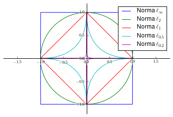

# Titlu

## Achiziția comprimată a semnalelor cu reprezentări rare {#sec:stateart}

### Text

Am text *italic* si **bold** si _subliniat_. 

### Ecuații {#sec:ecuatii}

O ecuație inline este $p \geq 1$

Aici am o ecuație:

$$
 \|x\|_p = \left( \sum_i |x_i|^p \right) ^\frac{1}{p}
$$ {#eq:ec1}

si ma refer la ea ca ecuatia (@eq:ec1). E **obligatoriu** ca ecuația să fie
intr-un paragraf nou (separată cu linii goale inainte și după),

O listă cu ecuații inline si separate:

1.  $\|ax\| = |a| \cdot \|x\|$ (omogenitate)

1.  Și încă una aici 

$$\|x\| = 0 \iff x=0$$ {#eq:ec2}

1.  $\|x + y\| \leq \|x\| + \|y\|$ (inegalitatea triunghiului)

si o citez pe ultima ca (@eq:ec2).

Din păcate, pentru ca trebuie să pun ecuația într-un paragraf nou, **se întrerupe
numerotarea**!!

Și încă o ecuație cu cuvinte în interior (_unde_) și cazuri ():
$$
 \|x\|_0 = \sum_{i}^{} c_i, \textrm{ unde } c_i = \begin{cases} 1 , x_i \neq 0 \\ 0 , x_i = 0 \end{cases} 
$$

### Figuri

În Figura 1 sunt înfățișate sferele $\ell_p$ într-un spațiu bidimensional, adică punctele care au aceeași valoare a 
normei $\ell_p$ (aici, egală cu 1), pentru diverse valori ale lui $p$. Pentru $p = 0$, domeniul cuprinde doar cele două axe
(exceptând punctul 0). Se observă că valori mici ale lui $p$ implică puncte situate în apropierea celor două axe, funcționând astfel 
ca niște aproximații ale normei $\ell_0$. 

### Teoreme, definiții, citari

Definiție ca text:

**Definiţie.** [@OptimSpReprDonoho2003]: Fie matricea 
$A \in \mathbb{R}^{m \times n}$. *Spark*-ul matricii $A$, notat $\sigma$,
reprezintă numărul minim de coloane ale lui $A$ care sunt liniar independente.

Următoarea este o teoremă cu demonstrație, ca text:

**Teoremă.** [@OptimSpReprDonoho2003]: Fie $\gamma$ un vector rar cu 
$\|\gamma\|_0 = k$, achiziţionat cu o matrice $A$ ca în (@eq:ec1).
Fie $\sigma$ *spark*-ul matricii $A$. Dacă $k < \sigma / 2$, atunci $\gamma$
este soluţie unică a problemei de optimizare (@eq:ec2).

_Demonstraţie._ Demonstraţia rezultă imediat: dacă (@eq:ec1)
ar admite o soluţie diferită, cu raritatea $k' \leq k$, atunci diferenţa
celor două soluţii ar produce un vector de raritate $(k'+k) < \sigma$ care 
aparţine spaţiului nul al matricii $A$. Acest lucru înseamnă un set de coloane
liniar independente ale lui $A$ în număr mai mic decât *spark*-ul matricii, 
ceea ce contrazice definiţia acestuia.

Din păcate, calcularea *spark*-ului unei matrici este o problemă de complexitate
combinatorică, şi deci *NP-hard*, ceea ce limitează aplicabilitatea practică
a teoremei.

### Algoritmi

**Algoritmul Orthogonal Matching Pursuit (OMP)**

*Fenced clode block*:

~~~~~~
   1. $r^{(0)} \leftarrow y$
   2. $\gamma_i \leftarrow 0, \forall i$
   3. repetă:  
       3.1.    Găsește $a_m \in A$ cu coeficientul de corelația maxim $\left\langle r^{(k)}, a_m \right\rangle$  
       3.2.    Adaugă $m$ la setul indicilor atomilor selectați, $T \leftarrow T \cup \{m\}$  
       3.3.    Proiectează $x$ pe subspațiul atomilor $a_{\{T\}}$, obținând vectorul coeficienților de la pasul $k$: $\gamma_{\{T\}}^{(k+1)} = a_{\{T\}}^{\dagger} x$  
       3.4.    Actualizează reziduul: $r^{(k+1)} \leftarrow x - A \cdot \gamma^{(k+1)}$
   4. până la un criteriu de oprire (de ex. $\|r^{(k)}\|_2 \le \epsilon$, sau număr fixat de iterații}  
~~~~~~

sau *clode block* normal (cu 4 spații):

    1. $r^{(0)} \leftarrow y$
    2. $\gamma_i \leftarrow 0, \forall i$
    3. repetă:  
        3.1.    Găsește $a_m \in A$ cu coeficientul de corelația maxim $\left\langle r^{(k)}, a_m \right\rangle$  
        3.2.    Adaugă $m$ la setul indicilor atomilor selectați, $T \leftarrow T \cup \{m\}$  
        3.3.    Proiectează $x$ pe subspațiul atomilor $a_{\{T\}}$, obținând vectorul coeficienților de la pasul $k$: $\gamma_{\{T\}}^{(k+1)} = a_{\{T\}}^{\dagger} x$  
        3.4.    Actualizează reziduul: $r^{(k+1)} \leftarrow x - A \cdot \gamma^{(k+1)}$
    4. până la un criteriu de oprire (de ex. $\|r^{(k)}\|_2 \le \epsilon$, sau număr fixat de iterații}  

Din păcate, în *code blocks* nu se parsează ecuațiile Latex. Singura soluție 
este să le scriu ca liste obișnuite (de ex. cu 3 spații):

   1. $r^{(0)} \leftarrow y$
   2. $\gamma_i \leftarrow 0, \forall i$
   3. repetă:  
       3.1.    Găsește $a_m \in A$ cu coeficientul de corelația maxim $\left\langle r^{(k)}, a_m \right\rangle$  
       3.2.    Adaugă $m$ la setul indicilor atomilor selectați, $T \leftarrow T \cup \{m\}$  
       3.3.    Proiectează $x$ pe subspațiul atomilor $a_{\{T\}}$, obținând vectorul coeficienților de la pasul $k$: $\gamma_{\{T\}}^{(k+1)} = a_{\{T\}}^{\dagger} x$  
       3.4.    Actualizează reziduul: $r^{(k+1)} \leftarrow x - A \cdot \gamma^{(k+1)}$
   4. până la un criteriu de oprire (de ex. $\|r^{(k)}\|_2 \le \epsilon$, sau număr fixat de iterații}  

### Tabele

TODO
